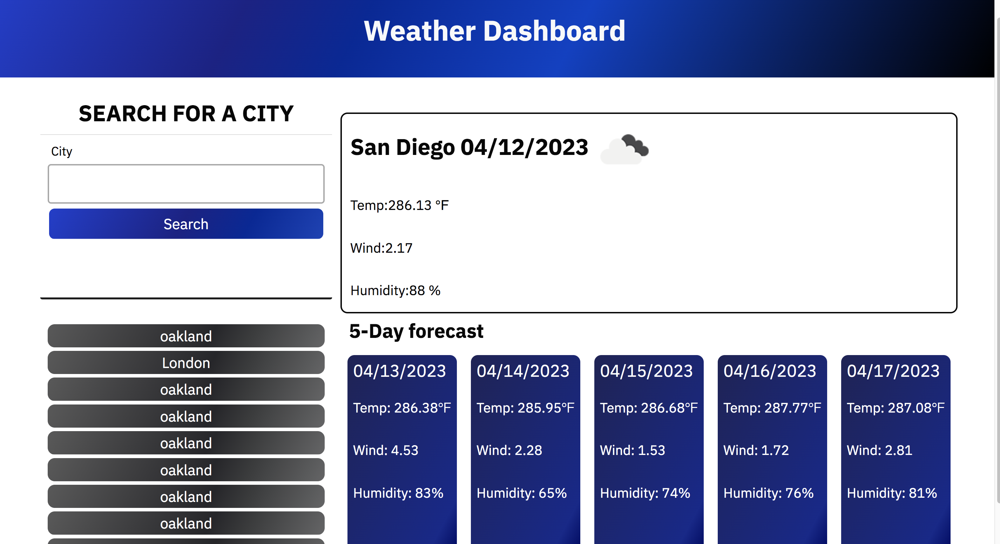

 #  Weather Forecast


## **Description**
* APIs are required to connect apps and carry out a predefined function that is based on sharing data and running pre-defined operations. They operate as a go-between, enabling programmers to create fresh programmatic interactions across the many programs that consumers and companies use on a daily basis.
The goal of this project is to create a website that will retrieve weather data based on the city you select.


* ### Learn About

* [Documentation WeatherApi](https://openweathermap.org/api/geocoding-api)
* [Documentation Java Script](https://www.javascript.com/learn)
* [Documentation Bootstrap](https://getbootstrap.com/docs/5.3/getting-started/introduction/)


## **Code Learning Points**

- * Documents have been updated with learning point comments. As an illustration:  

### 

```Js
function getWeather(cityName) {
  // make api call to get lat and long//
  fetch("http://api.openweathermap.org/geo/1.0/direct?q="+cityName+"&limit=1&appid=f20f308b4dfef9c605356d708343cfae")
  .then(res => res.json())
  .then(data => {
    // extract lat and lon from data//
    console.log(data)
    var lat = data[0].lat;
    var lon = data[0].lon;
    getForcast(lat, lon, data[0].name)
  })
}
```

- * HTML appropriately enhanced with comments to provide readers a much clearer understanding of the code.

```html
<body class="flex-column  min-vh-100 justify-content-between">
  <!--container for header-->
  <header class="hero bg-primary text-center">
  <h1 class="app-title fs-1 fw-bold text-light">Weather Dashboard</h1>
 </header>

 
<main class="container text-center">

  <div class="row row-cols-2">
<!---Col#1 search input-->
    <div class="card col-4"> 
      <h2 class="card-header text-uppercase fw-bold">Search for a City</h2>
      <form id="user-form" class="card-body">
          <label class="form-label text-start fw-normal" for="username">City</label>
          <input name="username" id="cityName" type="text" autofocus="true" class="form-input" />
        <button id="search-btn" type="submit" class="btn">Search</button>
      </form>
   </div>

```

## **Technology Used**

| Technology Used         | Resource URL           | 
| ------------- |:-------------:| 
| HTML    | [https://developer.mozilla.org/en-US/docs/Web/HTML](https://developer.mozilla.org/en-US/docs/Web/HTML)|  
| CSS     | [https://developer.mozilla.org/en-US/docs/Web/CSS](https://developer.mozilla.org/en-US/docs/Web/CSS)      |   
| Git | [https://git-scm.com/](https://git-scm.com/)     |    
| Js  | [https://developer.mozilla.org/en-US/docs/Web/JavaScript]  | 
|  Bootstrap  | [https://getbootstrap.com/](https://getbootstrap.com/)  | 

## **Prerequisites**

**Install or open the internet browser of your choice.**

*  **Examples Below:**

- Google Chrome
- Safari
- OPera
- Mozilla Firefox
- Internet Explorer

### **Installing**

**Click the link below:** 

[Link to Website](https://cruzkenneth504.github.io/weather-forcast/)

## **Built With**

* [HTML Dev](https://developer.mozilla.org/en-US/docs/Web/HTML)
* [HTML W3](https://www.w3schools.com/html/default.asp)   
* [CSS Dev](https://developer.mozilla.org/en-US/docs/Web/CSS)
* [CSS W3](https://www.w3schools.com/css/default.asp)
* [JS]()
* [Bootstrap](https://getbootstrap.com/)
* [Weather API](https://openweathermap.org/api)

## **Visual**

* For webside testing, click the image below. Just enter your preferred city into the text field.

[](https://cruzkenneth504.github.io/weather-forcast/)


## **Author**

* **Kenneth Cruz** 


- [Website Weather](https://cruzkenneth504.github.io/weather-forcast/)
- [Link to Github Repo](https://github.com/Cruzkenneth504/weather-forcast)
- [Link to Github](https://github.com/cruzkenneth504)
- [Link to LinkedIn](linkedin.com/in/cruzkenneth504)

       
## **License**

This project is licensed under the MIT License

## **Acknowledgments**

* [UCB BootCamp](https://bootcamp.berkeley.edu/)
* [DevTools](https://dev.to/)
* [Youtube](https://www.youtube.com/)
* [Bootcamp Inatructors](https://bootcamp.berkeley.edu/)
* [Tutors]( https://tinyurl.com/BootCampTutorTeam)
* [Bootstrap](https://getbootstrap.com/) 

